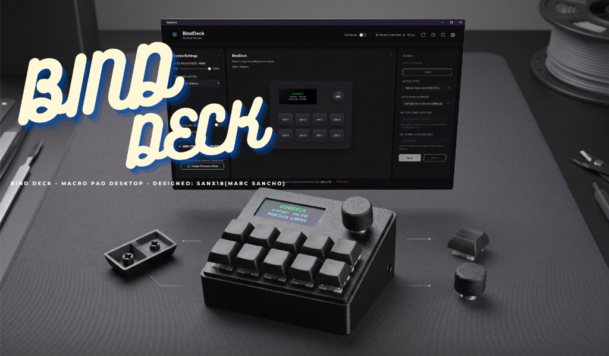

  
  # BindDeck Companion for ESP32
  
  **An open-source, customizable programmable macro controller, powered by ESP32 and an intuitive PC App.**

  
  
  
  

  

---

If you found the project useful and want to support future designs, thank you very much for the support ❤️:

## 🌟 BindDeck: Your Smart Macro Pad with ESP32 and OLED Screen
BindDeck is a complete hardware and software ecosystem designed to boost your productivity and your setup. It turns a simple ESP32 microcontroller into a powerful custom macro keyboard, equipped with an interactive OLED screen, a rotary encoder for dial control, and mechanical buttons. It is the ideal accessory for streamers, programmers, video editors, and any technology enthusiast.

🖥️ BIND DECK APP (WINDOWS) : https://github.com/SanX18/BindDeck

## 🚀 What does the application do?
BindDeck is not just a shortcut keyboard; it is an interactive tool. Everything you see on your PC screen syncs instantly with your physical device:

* **Launcher and Shortcuts (8 Buttons):** Assign complex keyboard combinations (e.g. CTRL+SHIFT+S), launch your favorite programs (calc.exe, spotify.exe) or execute entire blocks of text with a single press.
* **Infinite Rotary Encoder (KY-040):** Turn the dial left or right with stepped tactile feedback to adjust the overall volume, zoom, navigate tabs or use undo/redo. Plus, pressing it acts as an extra button!
* **Real-Time Hardware Monitor:** Its OLED screen not only shows cute animations when you press the buttons; at rest it acts as a telemetry monitor, showing your CPU and GPU temperatures and load (usage) in real-time.
* **Customizable Texts:** Through the app, you can write what text you want to appear on the OLED screen individually for each of the buttons.
* **Hybrid Dual Connectivity (Wired or Wireless):** You can use it via USB cable, or 100% Wirelessly. It sends your macros to the PC using Bluetooth LE (for low battery consumption) and receives PC temperature data via Wi-Fi UDP Zero-Config.

---

## 🖨️ Print Profile Details

This print profile is optimized and tested in **Bambu Studio** to ensure the best surface quality, strength, and ease of assembly.

### ⚙️ Recommended Settings:

* **Nozzle:** 0.4 mm
* **Layer Height:** 0.20 mm (or 0.16 mm for greater detail)
* **Wall Loops:** 2 – 3 walls
* **Infill:** 15% – 20% (Grid / Gyroid)
* **Supports:** Review according to plate orientation (tree supports recommended if applicable)*
* **Bed Adhesion:** Textured PEI Plate / Smooth PEI (Clean with soap and water if necessary)

### 🧵 Materials:

* PLA / PLA+ (Recommended for decorative or indoor use)
* PETG* (Recommended if mechanical strength or higher temperature resistance is required)

### 📦 Profile Contents:

* Organized plate with all parts ready to print directly from the **Bambu Handy** app or from the slicer.
* Optimized geometry with no need for additional adjustments.

💬 *If you liked the design, don't forget to leave your rating ⭐⭐⭐⭐⭐, photos of your result, and give it a Boost if you found it useful!*

---

## 🛠️ Hardware Used (BOM)
To assemble the electronics for this case, you will need very inexpensive and accessible components.

1. **Microcontroller:** ESP32 (The classic ESP32-WROOM-32 Dev Kit model is recommended).
2. **Screen:** 0.96" I2C OLED Screen (128x64 resolution, with SSD1306 controller).
3. **Rotary Encoder:** 1x KY-040 Module (Replaces the old potentiometer, offering infinite rotation and button/click function when pressed).
4. **Switches / Buttons:** 8x Mechanical Switches. (Outemu Red switches were used in this project. Being linear and quiet, they offer a smooth, fast feel perfect for macros without the classic noisy "click").
5. **ON/OFF Switch:** 1x SS-12F15
6. **Battery and Charging (Wireless):** 1x 3.7V LiPo Battery (1400mAh)(49×34×5.4 mm) + 1x TP4056 Charger Module (USB-C).
7. **Wiring:** Dupont cables to make the internal connections (or a custom PCB).
8. **Extras:** Keycaps of your choice to decorate the mechanical switches and a "Knob" or cap for the encoder.
9. **Battery Sensor:** 2x 10K Ohm Resistors (Used to create a voltage divider and allow the ESP32 to read the remaining charge percentage without burning out).

---

## 🔌 Physical Connection Diagram

### 🔋 Power and Battery Reader (TP4056)
* **Positive (+) Battery Wire:** Connect to the B+ pin of the TP4056.
* **Negative (-) Battery Wire:** Connect to the B- pin of the TP4056.
* **OUT+ (Output) of the TP4056:** Connect to the VIN or 5V pin of the ESP32.
* **OUT- (Output) of the TP4056:** Connect to the GND pin of the ESP32.

### ⚡ Battery Percentage Sensor (Voltage Divider)
Since the ESP32 cannot read the 4.2V from the battery directly, we need to lower that voltage by half using two 10K resistors as follows:
* Solder one 10K Resistor from the OUT+ of the TP4056 module and connect it to the GPIO 35 pin of the ESP32.
* Solder the other 10K Resistor connecting the GPIO 35 pin to the GND pin of the ESP32. (This will divide the voltage in half, allowing BindDeck to show you an accurate battery icon on the screen).

### 📺 OLED Screen (I2C Communication)
* **VCC:** Connect to 3.3V of the ESP32.
* **GND:** Connect to GND of the ESP32.
* **SDA (Data Line):** Connect to GPIO 21.
* **SCL (Clock Line):** Connect to GPIO 22.

### 🎛️ Rotary Encoder (KY-040)
* **+ (VCC):** Connect to 3.3V of the ESP32.
* **GND:** Connect to GND of the ESP32.
* **CLK (Clock):** Connect to GPIO 18.
* **DT (Data):** Connect to GPIO 19.
* **SW (Encoder Button):** Connect to GPIO 5.

### ⌨️ Mechanical Switches (Outemu Red)
Each mechanical switch has two pins. One pin from all switches must be connected to GND (Ground). The remaining pin of each switch is connected to the following ESP32 pins:

* **Switch 1:** GPIO 13
* **Switch 2:** GPIO 12
* **Switch 3:** GPIO 14
* **Switch 4:** GPIO 27
* **Switch 5:** GPIO 26
* **Switch 6:** GPIO 25
* **Switch 7:** GPIO 33
* **Switch 8:** GPIO 32

*(💡 Tip: You can bridge or "daisy-chain" all the GND pins of the 8 switches, the screen, and the encoder with a single wire to run a single wire to the ESP32's GND pin).*

---

## 💻 Installation and Software All in One!
Forget about compiling code, installing Python, or using complex programming environments. The entire process is simplified so you can manage it directly from the Windows App:

1. Connect your ESP32 to the computer using a USB cable.
2. Open the BindDeck.exe desktop application (you can download it from the project's GitHub: SanX18/BindDeck).
3. **Install Firmware:** Inside the app, simply press the "Firmware" button and the application itself will take care of flashing (installing) the code onto your ESP32 automatically with a single click.
4. **Administrator Permissions:** The first time you open the App, Windows will ask for Administrator permissions. ⚠️ It is essential to accept them so that the internal reader (LibreHardwareMonitor) can read the temperature of your processor (CPU) and your graphics card (GPU) to send them to the small OLED screen.
5. **Ready to customize!** From that same application, you can configure what each button does, the action of turning the KY-040 encoder, change the screen texts, and adjust your entire ecosystem 100% visually.

*(The entire system works 100% locally and privately on your network, without the need for a connection to external servers or accounts).*

---

## 🇪🇸 Versión en Español / Spanish Version

  
  # BindDeck Companion for ESP32
  
  **Un controlador macro programable open-source y personalizable, potenciado por ESP32 y una intuitiva App de PC.**

  
  
  
  

  

---

Si encontraste útil el proyecto y quieres apoyar futuros diseños, muchas gracias por el apoyo ❤️:

## 🌟 BindDeck: Tu Macro Pad Inteligente con ESP32 y Pantalla OLED
BindDeck es un ecosistema completo de hardware y software diseñado para potenciar tu productividad y tu setup. Convierte un simple microcontrolador ESP32 en un potente teclado de macros personalizado, equipado con una pantalla OLED interactiva, un encoder rotativo para control de dial y botones mecánicos. Es el accesorio ideal para streamers, programadores, editores de vídeo y cualquier entusiasta de la tecnología.

🖥️ APP BIND DECK (WINDOWS) : https://github.com/SanX18/BindDeck

## 🚀 ¿Qué hace la aplicación?
BindDeck no es solo un teclado de atajos; es una herramienta interactiva. Todo lo que ves en la pantalla de tu PC se sincroniza al instante con tu dispositivo físico:

* **Lanzador y Atajos (8 Botones):** Asigna combinaciones complejas de teclado (ej. CTRL+SHIFT+S), lanza tus programas favoritos (calc.exe, spotify.exe) o ejecuta bloques enteros de texto con una sola pulsación.
* **Encoder Rotativo Infinito (KY-040):** Gira el dial a izquierda o derecha con tacto de pasos para ajustar el volumen general, hacer zoom, navegar por pestañas o usar deshacer/rehacer. ¡Además, al presionarlo actúa como un botón extra!
* **Monitor de Hardware en Tiempo Real:** Su pantalla OLED no solo muestra simpáticas animaciones cuando pulsas los botones; en reposo actúa como un monitor de telemetría, mostrando las temperaturas y la carga (uso) de tu CPU y GPU en tiempo real.
* **Textos Personalizables:** A través de la app, puedes escribir qué texto quieres que aparezca en la pantalla OLED de manera individual para cada uno de los botones.
* **Conectividad Dual Híbrida (Cable o Inalámbrico):** Puedes usarlo por cable USB, o de manera 100% Inalámbrica. Envía tus macros al PC usando Bluetooth LE (para un bajo consumo de batería) y recibe los datos de las temperaturas del PC vía Wi-Fi UDP Zero-Config.

---

## 🖨️ Perfil de Impresión / Print Profile Details

Este perfil de impresión está optimizado y probado en **Bambu Studio** para garantizar la mejor calidad de superficie, resistencia y facilidad de montaje.

### ⚙️ Ajustes recomendados / Recommended Settings:

* **Boquilla / Nozzle:** 0.4 mm
* **Altura de capa / Layer Height:** 0.20 mm (o 0.16 mm para mayor detalle)
* **Paredes / Wall Loops:** 2 – 3 paredes
* **Relleno / Infill:** 15% – 20% (Grid / Gyroid)
* **Soportes / Supports:** Revisar según orientación del plato (árbol / tree supports recomendados si aplica)*
* **Adhesión / Bed Adhesion:** Textured PEI Plate / Smooth PEI (Limpia con agua y jabón si es necesario)

### 🧵 Filamentos sugeridos / Materials:

* PLA / PLA+ (Recomendado para uso decorativo o interior)
* PETG* (Recomendado si requiere resistencia mecánica o mayor temperatura)

### 📦 Contenido del Perfil:

* Placa organizada con todas las piezas listas para imprimir directamente desde la app **Bambu Handy** o desde el slicer.
* Geometría optimizada sin necesidad de ajustes adicionales.

💬 *Si te ha gustado el diseño, ¡no olvides dejar tu valoración ⭐⭐⭐⭐⭐, fotos de tu resultado y darle a Boost si te ha sido útil!*

---

## 🛠️ Hardware Utilizado (BOM)
Para montar la electrónica de esta carcasa, necesitarás componentes muy económicos y accesibles.

1. **Microcontrolador:** ESP32 (Se recomienda el modelo clásico ESP32-WROOM-32 Dev Kit).
2. **Pantalla:** Pantalla OLED de 0.96" I2C (Resolución 128x64, con controlador SSD1306).
3. **Encoder Rotativo:** 1x Módulo KY-040 (Sustituye al antiguo potenciómetro, ofreciendo giro infinito y función de botón/clic al presionarlo).
4. **Switches / Botones:** 8x Switches Mecánicos. (En este proyecto se han utilizado switches Outemu Red. Al ser lineales y silenciosos, ofrecen un tacto suave, rápido y perfecto para macros sin el clásico "clic" ruidoso).
5. **Switch ON/OFF:** 1x SS-12F15
6. **Batería y Carga (Inalámbrico):** 1x Batería LiPo de 3.7V (1400mAh)(49×34×5.4 mm) + 1x Módulo cargador TP4056 (USB-C).
7. **Cableado:** Cables Dupont para realizar las conexiones interiores (o una PCB personalizada).
8. **Extras:** Keycaps (teclas) de tu elección para decorar los switches mecánicos y un "Knob" o tapa para el encoder.
9. **Sensor de Batería:** 2x Resistencias de 10K Ohmios (Sirven para crear un divisor de tensión y permitir que el ESP32 lea el porcentaje de carga restante sin quemarse).

---

## 🔌 Diagrama de Conexiones Físicas

### 🔋 Alimentación y Lector de Batería (TP4056)
* **Cable Positivo (+) de la Batería:** Conectar al pin B+ del TP4056.
* **Cable Negativo (-) de la Batería:** Conectar al pin B- del TP4056.
* **OUT+ (Salida) del TP4056:** Conectar al pin VIN o 5V del ESP32.
* **OUT- (Salida) del TP4056:** Conectar al pin GND del ESP32.

### ⚡ Sensor de Porcentaje de Batería (Divisor de Tensión)
Como el ESP32 no puede leer los 4.2V de la batería directamente, necesitamos bajar ese voltaje a la mitad usando dos resistencias de 10K de la siguiente manera:
* Suelta una Resistencia de 10K desde el OUT+ del módulo TP4056 y conéctala al pin GPIO 35 del ESP32.
* Suelta la otra Resistencia de 10K conectando el pin GPIO 35 hacia el pin GND del ESP32. (Esto dividirá el voltaje a la mitad, permitiendo que BindDeck te muestre un icono de batería preciso en la pantalla).

### 📺 Pantalla OLED (Comunicación I2C)
* **VCC:** Conectar a 3.3V del ESP32.
* **GND:** Conectar a GND del ESP32.
* **SDA (Línea de Datos):** Conectar al GPIO 21.
* **SCL (Línea de Reloj):** Conectar al GPIO 22.

### 🎛️ Encoder Rotativo (KY-040)
* **+ (VCC):** Conectar a 3.3V del ESP32.
* **GND:** Conectar a GND del ESP32.
* **CLK (Reloj):** Conectar al GPIO 18.
* **DT (Datos):** Conectar al GPIO 19.
* **SW (Botón del Encoder):** Conectar al GPIO 5.

### ⌨️ Switches Mecánicos (Outemu Red)
Cada switch mecánico tiene dos patillas. Una patilla de todos los switches debe ir conectada a GND (Tierra). La patilla restante de cada switch se conecta a los siguientes pines del ESP32:

* **Switch 1:** GPIO 13
* **Switch 2:** GPIO 12
* **Switch 3:** GPIO 14
* **Switch 4:** GPIO 27
* **Switch 5:** GPIO 26
* **Switch 6:** GPIO 25
* **Switch 7:** GPIO 33
* **Switch 8:** GPIO 32

*(💡 Consejo: Puedes puentear o "cadenerar" con un mismo cable todas las patillas GND de los 8 switches, la pantalla y el encoder para llevar un único cable al pin GND del ESP32).*

---

## 💻 Instalación y Software ¡Todo en uno!
Olvídate de compilar código, instalar Python o usar entornos de programación complejos. Todo el proceso está simplificado para que lo gestiones directamente desde la App de Windows:

1. Conecta tu ESP32 al ordenador mediante un cable USB.
2. Abre la aplicación de escritorio BindDeck.exe (puedes descargarla desde el GitHub del proyecto: SanX18/BindDeck).
3. **Instala el Firmware:** Dentro de la app, simplemente pulsa el botón de "Firmware" y la propia aplicación se encargará de flashear (instalar) el código en tu ESP32 de forma automática con un solo clic.
4. **Permisos de Administrador:** La primera vez que abras la App, Windows te pedirá permisos de Administrador. ⚠️ Es imprescindible aceptarlos para que el lector interno (LibreHardwareMonitor) pueda leer la temperatura de tu procesador (CPU) y tu gráfica (GPU) para mandarlas a la pequeña pantalla OLED.
5. **¡Listo para personalizar!** Desde esa misma aplicación podrás configurar qué hace cada botón, la acción de girar el encoder KY-040, cambiar los textos de la pantalla y ajustar todo tu ecosistema de forma 100% visual.

*(Todo el sistema funciona de manera 100% local y privada en tu red, sin necesidad de conexión a servidores externos ni cuentas).*
